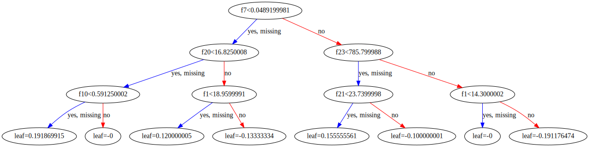

<!--

#################################################
### THIS FILE WAS AUTOGENERATED! DO NOT EDIT! ###
#################################################
# file to edit: index.ipynb
# command to build the docs after a change: nbdev_build_docs

-->

# Project name here

> Summary description here.


This file will become your README and also the index of your documentation.

## Install

`pip install xgb2sql`

## How to use

So easy even I could do it!
<div class="codecell" markdown="1">
<div class="input_area" markdown="1">

```python
from xgb2sql import core
import xgboost as xgb
from sklearn.datasets import load_breast_cancer
from sklearn.model_selection import train_test_split

X, y = load_breast_cancer(return_X_y=True)

X_train, X_test, y_train, y_test = train_test_split(X, y, random_state=0)

woo = xgb.XGBClassifier(n_estimators=5)
woo.fit(X_train, y_train)
xgb.to_graphviz(woo)
```

</div>
<div class="output_area" markdown="1">





</div>

</div>
<div class="codecell" markdown="1">
<div class="input_area" markdown="1">

```python
tree = core.xgb2sql(woo.get_booster(), 'breast_cancer')
print(tree)
```

</div>
<div class="output_area" markdown="1">

    WITH booster_output AS (
    	SELECT
    		CASE
    			WHEN ((f7 < 0.0489199981) OR (f7 IS NULL))
    			AND ((f20 < 16.8250008) OR (f20 IS NULL))
    			AND ((f10 < 0.591250002) OR (f10 IS NULL))
    		THEN 0.191869915
    			WHEN ((f7 < 0.0489199981) OR (f7 IS NULL))
    			AND ((f20 < 16.8250008) OR (f20 IS NULL))
    			AND (f10 >= 0.591250002)
    		THEN 0
    			WHEN ((f7 < 0.0489199981) OR (f7 IS NULL))
    			AND (f20 >= 16.8250008)
    			AND ((f1 < 18.9599991) OR (f1 IS NULL))
    		THEN 0.120000005
    			WHEN ((f7 < 0.0489199981) OR (f7 IS NULL))
    			AND (f20 >= 16.8250008)
    			AND (f1 >= 18.9599991)
    		THEN -0.13333334
    			WHEN (f7 >= 0.0489199981)
    			AND ((f23 < 785.799988) OR (f23 IS NULL))
    			AND ((f21 < 23.7399998) OR (f21 IS NULL))
    		THEN 0.155555561
    			WHEN (f7 >= 0.0489199981)
    			AND ((f23 < 785.799988) OR (f23 IS NULL))
    			AND (f21 >= 23.7399998)
    		THEN -0.100000001
    			WHEN (f7 >= 0.0489199981)
    			AND (f23 >= 785.799988)
    			AND ((f1 < 14.3000002) OR (f1 IS NULL))
    		THEN 0
    			WHEN (f7 >= 0.0489199981)
    			AND (f23 >= 785.799988)
    			AND (f1 >= 14.3000002)
    		THEN -0.191176474
    		END AS column_0, 
    		CASE
    			WHEN ((f7 < 0.0500999987) OR (f7 IS NULL))
    			AND ((f20 < 16.8250008) OR (f20 IS NULL))
    			AND ((f13 < 38.6049995) OR (f13 IS NULL))
    		THEN 0.17467472
    			WHEN ((f7 < 0.0500999987) OR (f7 IS NULL))
    			AND ((f20 < 16.8250008) OR (f20 IS NULL))
    			AND (f13 >= 38.6049995)
    		THEN 0.0302315652
    			WHEN ((f7 < 0.0500999987) OR (f7 IS NULL))
    			AND (f20 >= 16.8250008)
    			AND ((f1 < 18.9599991) OR (f1 IS NULL))
    		THEN 0.113052242
    			WHEN ((f7 < 0.0500999987) OR (f7 IS NULL))
    			AND (f20 >= 16.8250008)
    			AND (f1 >= 18.9599991)
    		THEN -0.124826349
    			WHEN (f7 >= 0.0500999987)
    			AND ((f22 < 103.25) OR (f22 IS NULL))
    			AND ((f21 < 25.9249992) OR (f21 IS NULL))
    		THEN 0.140555695
    			WHEN (f7 >= 0.0500999987)
    			AND ((f22 < 103.25) OR (f22 IS NULL))
    			AND (f21 >= 25.9249992)
    		THEN -0.0846852511
    			WHEN (f7 >= 0.0500999987)
    			AND (f22 >= 103.25)
    			AND ((f21 < 20.3549995) OR (f21 IS NULL))
    		THEN -0.01987583
    			WHEN (f7 >= 0.0500999987)
    			AND (f22 >= 103.25)
    			AND (f21 >= 20.3549995)
    		THEN -0.174933031
    		END AS column_1, 
    		CASE
    			WHEN ((f27 < 0.142349988) OR (f27 IS NULL))
    			AND ((f20 < 17.6149998) OR (f20 IS NULL))
    			AND ((f13 < 35.2600021) OR (f13 IS NULL))
    		THEN 0.159918889
    			WHEN ((f27 < 0.142349988) OR (f27 IS NULL))
    			AND ((f20 < 17.6149998) OR (f20 IS NULL))
    			AND (f13 >= 35.2600021)
    		THEN 0.0472318567
    			WHEN ((f27 < 0.142349988) OR (f27 IS NULL))
    			AND (f20 >= 17.6149998)
    			AND ((f29 < 0.0649200007) OR (f29 IS NULL))
    		THEN -0.0155247366
    			WHEN ((f27 < 0.142349988) OR (f27 IS NULL))
    			AND (f20 >= 17.6149998)
    			AND (f29 >= 0.0649200007)
    		THEN -0.119407289
    			WHEN (f27 >= 0.142349988)
    			AND ((f23 < 729.549988) OR (f23 IS NULL))
    			AND ((f4 < 0.1083) OR (f4 IS NULL))
    		THEN 0.120342232
    			WHEN (f27 >= 0.142349988)
    			AND ((f23 < 729.549988) OR (f23 IS NULL))
    			AND (f4 >= 0.1083)
    		THEN -0.108723581
    			WHEN (f27 >= 0.142349988)
    			AND (f23 >= 729.549988)
    			AND ((f10 < 0.241250008) OR (f10 IS NULL))
    		THEN -0.0287595335
    			WHEN (f27 >= 0.142349988)
    			AND (f23 >= 729.549988)
    			AND (f10 >= 0.241250008)
    		THEN -0.163232192
    		END AS column_2, 
    		CASE
    			WHEN ((f7 < 0.0489199981) OR (f7 IS NULL))
    			AND ((f20 < 16.8250008) OR (f20 IS NULL))
    			AND ((f10 < 0.528550029) OR (f10 IS NULL))
    		THEN 0.151598975
    			WHEN ((f7 < 0.0489199981) OR (f7 IS NULL))
    			AND ((f20 < 16.8250008) OR (f20 IS NULL))
    			AND (f10 >= 0.528550029)
    		THEN 0.0131686451
    			WHEN ((f7 < 0.0489199981) OR (f7 IS NULL))
    			AND (f20 >= 16.8250008)
    			AND ((f1 < 18.9599991) OR (f1 IS NULL))
    		THEN 0.101920418
    			WHEN ((f7 < 0.0489199981) OR (f7 IS NULL))
    			AND (f20 >= 16.8250008)
    			AND (f1 >= 18.9599991)
    		THEN -0.113945559
    			WHEN (f7 >= 0.0489199981)
    			AND ((f23 < 785.799988) OR (f23 IS NULL))
    			AND ((f21 < 23.7399998) OR (f21 IS NULL))
    		THEN 0.131930456
    			WHEN (f7 >= 0.0489199981)
    			AND ((f23 < 785.799988) OR (f23 IS NULL))
    			AND (f21 >= 23.7399998)
    		THEN -0.0824727714
    			WHEN (f7 >= 0.0489199981)
    			AND (f23 >= 785.799988)
    			AND ((f12 < 2.02349997) OR (f12 IS NULL))
    		THEN -0.0275684185
    			WHEN (f7 >= 0.0489199981)
    			AND (f23 >= 785.799988)
    			AND (f12 >= 2.02349997)
    		THEN -0.155280709
    		END AS column_3, 
    		CASE
    			WHEN ((f27 < 0.145449996) OR (f27 IS NULL))
    			AND ((f22 < 107.599998) OR (f22 IS NULL))
    			AND ((f13 < 46.7900009) OR (f13 IS NULL))
    		THEN 0.142997682
    			WHEN ((f27 < 0.145449996) OR (f27 IS NULL))
    			AND ((f22 < 107.599998) OR (f22 IS NULL))
    			AND (f13 >= 46.7900009)
    		THEN 0.00895034242
    			WHEN ((f27 < 0.145449996) OR (f27 IS NULL))
    			AND (f22 >= 107.599998)
    			AND ((f21 < 20.0849991) OR (f21 IS NULL))
    		THEN 0.12236432
    			WHEN ((f27 < 0.145449996) OR (f27 IS NULL))
    			AND (f22 >= 107.599998)
    			AND (f21 >= 20.0849991)
    		THEN -0.0948726162
    			WHEN (f27 >= 0.145449996)
    			AND ((f23 < 710.200012) OR (f23 IS NULL))
    			AND ((f21 < 25.0550003) OR (f21 IS NULL))
    		THEN 0.0869635344
    			WHEN (f27 >= 0.145449996)
    			AND ((f23 < 710.200012) OR (f23 IS NULL))
    			AND (f21 >= 25.0550003)
    		THEN -0.0576682575
    			WHEN (f27 >= 0.145449996)
    			AND (f23 >= 710.200012)
    			AND ((f6 < 0.0892650038) OR (f6 IS NULL))
    		THEN -0.0451009385
    			WHEN (f27 >= 0.145449996)
    			AND (f23 >= 710.200012)
    			AND (f6 >= 0.0892650038)
    		THEN -0.147640571
    		END AS column_4
    	FROM breast_cancer
    	WHERE source = 'test'
    )
    
    SELECT
        1 / ( 1 + EXP ( - (
        column_0
    	+ column_1
    	+ column_2
    	+ column_3
    	+ column_4 ) ) ) AS score
    FROM booster_output


</div>

</div>
<div class="codecell" markdown="1">
<div class="input_area" markdown="1">

```python
Tada!
```

</div>

</div>
